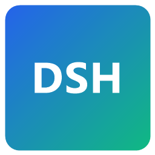

# DeepSeek Harness Desktop（DSH 桌面客户端 / DSH Desktop Client）

  

  
  
  
  
  

将 [DeepSeek Harness](https://github.com/deepseek-ai/deepseek-harness)（DSH）打包为 **Windows 桌面应用**：双击即用，无需手动安装 Node.js、无需命令行、无需打开浏览器。

> **English:** Package [DeepSeek Harness](https://github.com/deepseek-ai/deepseek-harness) (DSH) as a **Windows desktop app**: double-click to run — no manual Node.js install, no CLI, no browser needed.

> 本仓库是 **DeepSeek Harness 的非官方桌面壳**：前端界面与后端逻辑全部来自官方 DSH，本项目只负责「启动后端 → 打开窗口 → 托盘常驻」的桌面体验层。
>
> **English:** This repository is an **unofficial desktop shell for DeepSeek Harness**. The frontend UI and backend logic come entirely from the official DSH; this project only provides the desktop experience layer: "start backend → open window → stay in tray".

## ✨ 特性 / Features

- 🖥️ **独立桌面窗口**：无需浏览器标签页，任务栏/托盘独立图标 — *Standalone desktop window: no browser tab needed, dedicated taskbar/tray icon*
- ⚙️ **零配置启动**：自动探测并复用已有 DSH 实例（如浏览器打开的 :3080），否则自动启动**捆绑的后端**（自带 Node 运行时与 dsh 依赖，无需预装环境）— *Zero-config startup: automatically detects and reuses an existing DSH instance (e.g. :3080 in a browser), otherwise starts the **bundled backend** (ships its own Node runtime and dsh dependencies)*
- 🧊 **托盘常驻**：关闭窗口最小化到托盘，后端继续运行；托盘菜单「显示主窗口 / 退出」— *Tray resident: closing the window minimizes to tray while the backend keeps running; tray menu offers "Show Window / Quit"*
- 🧹 **干净退出**：退出时只终止本应用自启的后端进程，不影响外部 DSH 实例 — *Clean exit: only stops the backend process this app spawned; external DSH instances are untouched*
- 🔄 **可随官方同步更新**：通过更新 `DSH_VERSION` 重新打包即可跟随官方新版本（见下文）— *Sync with official releases: rebuild with an updated `DSH_VERSION` to follow upstream (see below)*

## 📦 下载与使用 / Download & Usage

### 方式一：安装版（推荐）/ Installer (Recommended)

从 **Releases** 页面按你的 CPU 架构下载对应安装包（约 163MB，内置 DSH 后端与 Node 运行时）/ *Download the installer matching your CPU architecture from the **Releases** page (~163MB, includes the DSH backend and Node runtime):*

- `DeepSeek-Harness-Desktop-<版本/version>-x64.exe` — 绝大多数 Intel/AMD 电脑 / *most Intel/AMD PCs*
- `DeepSeek-Harness-Desktop-<版本/version>-arm64.exe` — ARM 设备（骁龙 Windows、Apple Silicon Windows 等）/ *ARM devices (Snapdragon Windows, Apple Silicon Windows, etc.)*

> 不确定架构？任务管理器 → 性能 → CPU 查看架构标识。
> *Not sure about your architecture? Task Manager → Performance → CPU shows it.*

运行安装向导（可自选安装目录），安装后从桌面/开始菜单启动。*Run the setup wizard (custom install directory supported), then launch from the desktop/Start menu.*

### 首次启动 / First Launch

1. 应用自动启动内置的 DSH 后端（约 10-30 秒，日志在 `%APPDATA%\DeepSeek Harness Desktop\logs\backend.log`）— *The app starts the bundled DSH backend automatically (~10-30s; log at `%APPDATA%\DeepSeek Harness Desktop\logs\backend.log`)*
2. 若本机 `127.0.0.1:3080` 已有 DSH 在运行（比如浏览器开着 DSH），桌面端会**直接复用**，不会重复启动 — *If a DSH instance is already running on `127.0.0.1:3080` (e.g. opened in a browser), the desktop app **reuses** it instead of starting another*
3. 会话数据、设置与 Web 版完全一致（存储在 `~/.dsh`，由 DSH 后端统一管理）— *Session data and settings are shared with the Web version (stored in `~/.dsh`, managed by the DSH backend)*

## 🤖 自动化 / Automation (CI / Updates / Portable)

- **GitHub Actions 自动构建**：push `v*` tag 即自动构建 x64 + arm64 安装包并创建草稿 Release（`.github/workflows/build.yml`），发布前可人工检查 — *Auto-build via GitHub Actions: pushing a `v*` tag builds x64 + arm64 installers and creates a draft Release (`.github/workflows/build.yml`); human review before publishing*
- **自动更新**：应用集成 electron-updater，发现 GitHub 新版本时提示下载更新 — *Auto-update: electron-updater prompts to download new GitHub releases*
- **官方版本提醒**：启动后检查官方 `@deepseek-ai/dsh` 最新版，有新版时托盘提示 — *Official version reminder: checks the latest `@deepseek-ai/dsh` on startup and shows a tray balloon when a new version is out*
- **便携版**：`npm run dist` 同时产出 `*-portable.exe`（免安装，双击即用）— *Portable build: `npm run dist` also produces `*-portable.exe` (no install required)*
- **多语言**：启动画面与托盘菜单自动跟随系统语言（中/英）— *Bilingual: splash screen and tray menu follow the system language (zh/en)*

## 📦 安装包体积优化 / Installer Size Optimization

- 安装包约 **163MB**（解压后约 600MB，含完整 DSH 后端 + Node 运行时）— *Installer ~**163MB** (~600MB unpacked, includes full DSH backend + Node runtime)*
- 构建时自动裁剪多平台二进制（node-pty / sharp / ripgrep 仅保留 win32-x64），安装包从 177MB 降至 163MB，解压体积减少约 80MB — *Multi-platform binaries are trimmed at build time (node-pty / sharp / ripgrep keep only win32-x64), shrinking the installer from 177MB to 163MB and unpacked size by ~80MB*
- Electron 语言包仅保留中文与英文（46MB → 1MB）— *Electron locales trimmed to zh/en only (46MB → 1MB)*
- 启动时显示加载画面，后端就绪后自动进入主界面 — *Splash screen shown while the backend boots, main UI opens when ready*

## 🛠️ 从源码构建 / Build from Source

### 环境要求 / Requirements

- Windows 10/11 x64
- Node.js ≥ 20（构建机需要；最终用户不需要 / *required on the build machine; end users don't need it*)
- 网络（首次构建需下载 Electron 与 npm 依赖 / *network access — first build downloads Electron and npm deps*)

### 构建步骤 / Steps

    git clone https://github.com/InkWord01/DeepSeekHarness----Desktop.git
    cd DeepSeekHarness----Desktop
    npm install
    npm run prepare:backend   # 安装捆绑后端（dsh 运行时 + node.exe）到 resources/backend / install bundled backend into resources/backend
    npm run dist              # 产出 release/DeepSeek Harness Desktop Setup <ver>.exe / produce the setup exe

开发调试：`npm run dev`（复用已有 3080 实例或自动启动后端）— *Development: `npm run dev` (reuses an existing :3080 instance or starts the backend automatically).*

> **无管理员权限构建 / Building without admin rights**：若构建机无法创建符号链接（winCodeSign 解压报错），项目已内置规避方案（`signAndEditExecutable: false` + afterPack 钩子写入图标/版本），直接 `npm run dist` 即可，无需额外处理。*If the build machine cannot create symlinks (winCodeSign extraction errors), the project ships a workaround (`signAndEditExecutable: false` + afterPack hook writes icon/version); just run `npm run dist`.*

## 🔄 随官方新版本同步更新 / Syncing with Official DSH Releases

官方 DSH 发布新版本后，按以下步骤更新本桌面端 / *When the official DSH releases a new version, update this desktop app as follows:*

1. 查看官方版本号（如 `0.2.0`）：<https://www.npmjs.com/package/@deepseek-ai/dsh> — *Check the official version (e.g. `0.2.0`)*
2. 修改 `package.json` 中 `devDependencies["@deepseek-ai/dsh"]` 的版本号 — *Update the version in `devDependencies["@deepseek-ai/dsh"]`*
3. 重新构建 / *Rebuild*:

       npm install
       npm run prepare:backend
       npm run dist

4. 更新 `version` 字段并发布新的 Release（附上构建产物）— *Bump the `version` field and publish a new Release (attach the artifacts)*

这样用户下载新版桌面端即可使用官方最新功能。*Users then get the latest official features by downloading the new desktop release.*

## 🤝 贡献指南 / Contribution Guide（只读仓库 / read-only repo）

本仓库为**开源只读仓库**：代码对所有人开放（MIT License），欢迎任何人**下载、使用、学习**，但**不允许直接推送修改**（只有仓库维护者可以合并变更）。
*This is an **open-source read-only repository** (MIT License): everyone is welcome to **download, use, and learn** from it, but **direct pushes are not allowed** (only the maintainer can merge changes).*

如果你想改进 / *To contribute:*

- 提 **Issue**：报告问题、建议新功能 — *File an **Issue** for bugs or feature requests*
- 提 **Discussion**：交流使用心得 — *Start a **Discussion** to share experiences*
- 想贡献代码：请 Fork 后开发，通过 Issue 联系维护者，由维护者评估合并 — *For code: fork, develop, and contact the maintainer via an Issue for review and merge*

## 📁 项目结构 / Project Structure

    src/main.js                 # Electron 主进程：后端管理、窗口、托盘、生命周期 / main process: backend, window, tray, lifecycle
    src/preload.js              # 渲染进程桥（只读信息暴露）/ renderer bridge (read-only info)
    scripts/prepare-backend.mjs # 构建捆绑后端（dsh 依赖树 + node.exe）/ builds the bundled backend
    scripts/afterPack.js        # 打包后写入图标与版本信息 / writes icon & version info after pack
    scripts/wcs-mirror.mjs      # 本地二进制镜像代理（构建辅助，可选）/ local binary mirror proxy (optional build aid)
    build/                      # 图标资源 / icon assets
    resources/backend/          # 构建时生成：捆绑的 DSH 后端（不入库）/ generated at build time: bundled DSH backend (not committed)
    release/                    # 构建输出（不入库）/ build output (not committed)

## ⚙️ 高级配置 / Advanced Configuration

| 环境变量 / Env var | 作用 / Purpose | 默认值 / Default |
| --- | --- | --- |
| `DSH_DESKTOP_PORT` | 覆盖后端端口（多开/测试）/ Override the backend port (multi-instance/testing) | `3080` |
| `DSH_VERSION` | 构建捆绑的 dsh 版本（`npm run prepare:backend` 时）/ Bundled dsh version for `npm run prepare:backend` | `^0.1.0-rc.6` |

## 📄 许可证 / License

- 本仓库（桌面壳代码）：MIT License，见 [LICENSE](LICENSE) — *This repo (desktop shell code): MIT License, see [LICENSE](LICENSE)*
- 内置的 DeepSeek Harness 后端与界面：版权归 DeepSeek 官方所有 — *The bundled DeepSeek Harness backend and UI are copyrighted by DeepSeek*

## ⚠️ 声明 / Disclaimer

本项目与 DeepSeek 官方无隶属关系，是社区维护的桌面封装。使用时请遵守 DeepSeek 的服务条款与所在地区法律法规。
*This project is not affiliated with DeepSeek; it is a community-maintained desktop wrapper. Please comply with DeepSeek's terms of service and local laws.*
